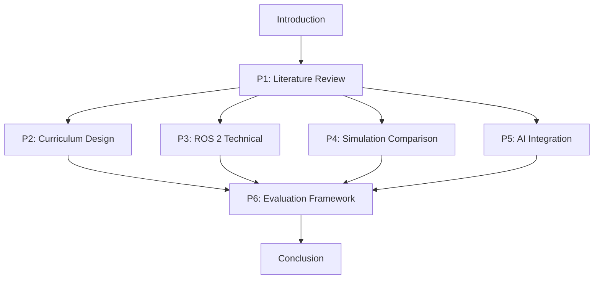

# Content Structure Model: Physical AI Capstone Quarter Paper

**Phase**: 1 (Design & Content Architecture)
**Date**: 2025-12-17
**Purpose**: Define the hierarchical structure of paper content, section relationships, word count allocations, and citation distribution

## Document Metadata Entity

```yaml
DocumentMetadata:
  title: "Physical AI Education: A Capstone Curriculum for Humanoid Robotics"
  subtitle: "Integrating ROS 2, Simulation Technologies, and AI-Robot Interaction"
  authors: [TBD]
  affiliation: [TBD]
  date: "2025-12-17"
  word_count_target: 6500
  word_count_range: [5000, 7000]
  format: "APA 7th Edition"
  output: "PDF with embedded citations"
  abstract_length: [150, 250]
  sections: 8  # Introduction, P1-P6, Conclusion
  total_sources_required: 15
  peer_reviewed_minimum: 8
```

## Section Entities and Relationships

### Section Hierarchy

```
Paper (Root Entity)
├── Metadata
│   ├── TitlePage
│   └── Abstract (150-250 words)
├── Introduction (300 words)
├── Section 2: Literature Review (P1, 1500 words)
│   ├── Subsection 2.1: Physical AI Definitions
│   ├── Subsection 2.2: ROS 2 Middleware Research
│   ├── Subsection 2.3: Simulation Technologies
│   └── Subsection 2.4: Robotics Education Pedagogy
├── Section 3: Curriculum Design Analysis (P2, 1200 words)
│   ├── Subsection 3.1: Module Structure Analysis
│   ├── Subsection 3.2: Pedagogical Framework
│   └── Subsection 3.3: Technology Selection Rationale
├── Section 4: ROS 2 Technical Deep-Dive (P3, 1000 words)
│   ├── Subsection 4.1: ROS 2 Architecture
│   ├── Subsection 4.2: Python Integration with rclpy
│   └── Subsection 4.3: URDF Robot Modeling
├── Section 5: Simulation Platform Comparison (P4, 800 words)
│   ├── Subsection 5.1: Gazebo Analysis
│   ├── Subsection 5.2: Unity Analysis
│   └── Subsection 5.3: NVIDIA Isaac Comparison
├── Section 6: AI-Robot Integration (P5, 700 words)
│   ├── Subsection 6.1: VSLAM Navigation
│   ├── Subsection 6.2: Vision-Language-Action Models
│   └── Subsection 6.3: Multi-modal Perception
├── Section 7: Evaluation Framework (P6, 600 words)
│   ├── Subsection 7.1: Assessment Framework
│   ├── Subsection 7.2: Implementation Challenges
│   └── Subsection 7.3: Future Directions
├── Conclusion (200 words)
└── References (15+ sources, APA 7th)
```

## Section Entity Model

### Section Attributes

```yaml
Section:
  id: string  # e.g., "P1", "P2", "Introduction"
  title: string
  word_count_target: integer
  word_count_tolerance: [integer, integer]  # [min, max]
  priority: string  # "P1" through "P6" or "Core" (Intro/Conclusion)
  dependencies: list[string]  # Other sections this depends on
  subsections: list[Subsection]
  source_requirements:
    peer_reviewed: integer
    technical_docs: integer
    total: integer
  key_topics: list[string]
  acceptance_criteria: list[string]
  status: enum  # [Not Started, Outlined, Drafted, Revised, Complete]
```

### Example: P1 Section Entity

```yaml
Section_P1_Literature_Review:
  id: "P1"
  title: "Literature Review: Physical AI and Robotics Education"
  word_count_target: 1500
  word_count_tolerance: [1300, 1700]
  priority: "P1"
  dependencies: []  # No dependencies (foundational section)
  subsections:
    - id: "P1.1"
      title: "Physical AI: Definitions and Evolution"
      word_count: 400
      topics: ["embodied AI", "physical world interaction", "robotics evolution"]
    - id: "P1.2"
      title: "ROS 2 Middleware for Robotics"
      word_count: 400
      topics: ["ROS 2 architecture", "DDS middleware", "real-time communication"]
    - id: "P1.3"
      title: "Simulation Technologies Landscape"
      word_count: 400
      topics: ["Gazebo", "Unity", "Isaac Sim", "digital twins"]
    - id: "P1.4"
      title: "Pedagogical Approaches in Robotics Education"
      word_count: 300
      topics: ["hands-on learning", "project-based learning", "STEM education"]
  source_requirements:
    peer_reviewed: 4  # Higher allocation for foundational section
    technical_docs: 2
    total: 6
  key_topics:
    - "Physical AI definition and scope"
    - "ROS 2 as middleware standard"
    - "Simulation tools comparison"
    - "Educational methodology for robotics"
  acceptance_criteria:
    - "All claims about Physical AI traced to peer-reviewed sources"
    - "ROS 2 architecture cited from official docs and academic papers"
    - "Simulation platforms compared with technical specifications or benchmarks"
    - "Education approaches supported by pedagogy literature"
  status: "Not Started"
```

## Citation Entity Model

### Citation Attributes

```yaml
Citation:
  citation_id: string  # e.g., "P1-01", "P2-03"
  type: enum  # [PeerReviewed, TechnicalDoc, Book, WhitePaper]
  authors: list[string]
  year: integer
  title: string
  publication: string  # Journal, conference, or publisher
  doi_or_url: string
  sections_used_in: list[string]  # ["P1", "P3"]
  claim_support: list[string]  # Specific claims this source supports
  status: enum  # [Identified, Acquired, Read, Cited, Verified]
  notes: string
```

### Citation Distribution Target

```yaml
CitationDistribution:
  total_target: 15
  peer_reviewed_target: 8
  by_section:
    P1_Literature_Review:
      total: 6
      peer_reviewed: 4
    P2_Curriculum_Design:
      total: 3
      peer_reviewed: 2
    P3_ROS2_Technical:
      total: 2
      peer_reviewed: 1
    P4_Simulation_Comparison:
      total: 2
      peer_reviewed: 1
    P5_AI_Integration:
      total: 3
      peer_reviewed: 2
    P6_Evaluation:
      total: 2
      peer_reviewed: 1
    Shared_Multiple_Sections:
      total: 0
      peer_reviewed: 0
      note: "Some sources may support multiple sections; counts deduplicated"
```

## Content Flow and Dependencies

### Section Dependency Graph



**Interpretation**:
- **Introduction** provides motivation and research questions; written after P1 outline complete
- **P1 (Literature Review)** is foundational; must be substantially complete before P2-P5
- **P2-P5** can be developed in parallel after P1 is drafted (though P2-P5 priority order recommended)
- **P6 (Evaluation)** synthesizes P2-P5; written last among content sections
- **Conclusion** written after all content sections complete

### Writing Workflow States

```yaml
ContentStates:
  sections:
    - name: "Not Started"
      description: "Section identified but no outline or content"
    - name: "Outlined"
      description: "Subsection structure defined, topic sentences drafted"
    - name: "Drafted"
      description: "Full content written, citations included (may be incomplete)"
    - name: "Revised"
      description: "Peer review or self-review completed, substantial edits applied"
    - name: "Citation Complete"
      description: "All citations verified, references added, APA formatting correct"
    - name: "Validated"
      description: "Constitutional gates checked (word count, FK score, plagiarism, etc.)"
    - name: "Complete"
      description: "Section finalized, no further changes expected"
```

### Validation Rules

```yaml
ValidationRules:
  word_count:
    rule: "Each section must be within tolerance range"
    check_frequency: "After drafting and after each revision"
    enforcement: "WARN if outside tolerance; BLOCK final submission if outside hard limits"

  citations:
    rule: "Each factual claim must have in-text citation"
    check_frequency: "During drafting and at 50% checkpoint"
    enforcement: "WARN for missing citations; manual review required"

  readability:
    rule: "Flesch-Kincaid grade 10-12 per section"
    check_frequency: "At 50% and 75% checkpoints"
    enforcement: "WARN if outside range; revise language as needed"

  plagiarism:
    rule: "0% similarity excluding citations"
    check_frequency: "At 50%, 75%, and 100% checkpoints"
    enforcement: "BLOCK if >0% similarity; rewrite flagged passages"

  citation_format:
    rule: "All citations APA 7th edition format"
    check_frequency: "Continuous during drafting, final audit before submission"
    enforcement: "WARN for format errors; must fix before submission"

  reference_match:
    rule: "All in-text citations must have reference entry; no orphan references"
    check_frequency: "At 75% and 100% checkpoints"
    enforcement: "BLOCK if mismatches found; manual reconciliation required"
```

## Content Assembly Process

### Compilation Steps

1. **Drafting Phase**: Each section written as separate Markdown file in `paper/##-section-name/` directories
2. **Citation Management**: Zotero bibliography exported to `paper/09-references/references.bib`
3. **Compilation Tools**:
   - **Option A (Pandoc)**: Combine Markdown files with Pandoc, apply APA CSL style
     ```bash
     pandoc paper/*/*.md -o final/physical-ai-capstone-paper.pdf \
       --citeproc --bibliography=paper/09-references/references.bib \
       --csl=apa-7th-edition.csl --toc
     ```
   - **Option B (Manual Assembly)**: Copy all Markdown content to MS Word, apply APA template, insert citations from Zotero Word plugin
4. **Final Formatting**: Title page, page numbers, headers, abstract formatting per APA 7th edition
5. **PDF Generation**: Export from Word or LaTeX to PDF with embedded hyperlinks

### Quality Gate Checkpoints

```yaml
Checkpoints:
  25_percent:
    sections_complete: ["P1", "P2 Outlined"]
    validations:
      - "P1 word count in range"
      - "≥4 peer-reviewed sources cited in P1"
      - "First plagiarism check run"
    deliverable: "P1 drafted, P2-P6 outlined"

  50_percent:
    sections_complete: ["P1", "P2", "P3", "P4 Outlined"]
    validations:
      - "P1-P3 word counts in range"
      - "≥6 peer-reviewed sources cited"
      - "Readability check (FK 10-12)"
      - "Citation format audit"
      - "Second plagiarism check"
    deliverable: "P1-P3 drafted, P4-P6 outlined, Abstract drafted"

  75_percent:
    sections_complete: ["P1", "P2", "P3", "P4", "P5"]
    validations:
      - "All content sections drafted"
      - "≥8 peer-reviewed sources cited"
      - "Total word count 5000-7000"
      - "Full citation-reference audit"
      - "Third plagiarism check"
    deliverable: "All content drafted, Introduction and Conclusion drafted"

  100_percent:
    sections_complete: ["All"]
    validations:
      - "All 5 constitutional gates passed"
      - "All success criteria (SC-001 to SC-010) validated"
      - "Final plagiarism check"
      - "PDF generated and reviewed"
    deliverable: "Final PDF ready for submission"
```

## Key Entity Relationships

1. **Section → Subsection**: One-to-many (each section has multiple subsections)
2. **Section → Citation**: Many-to-many (sections reference multiple citations; citations may support multiple sections)
3. **Citation → Source**: One-to-one (each citation references one bibliographic source)
4. **Subsection → Topic**: One-to-many (each subsection covers multiple topics)
5. **Checkpoint → Validation**: One-to-many (each checkpoint runs multiple validation rules)

## Content Evolution Tracking

### Version Control Strategy

```yaml
VersionControl:
  repository: "Git repository for paper directory"
  commit_strategy:
    - "Commit after completing each subsection draft"
    - "Commit after each checkpoint validation"
    - "Commit after citation audits"
    - "Tag major milestones (25%, 50%, 75%, 100%)"
  branch_strategy:
    - "main: stable, validated content"
    - "drafting: active writing"
    - "revisions: post-review edits"
  file_structure:
    - "One Markdown file per subsection for granular version control"
    - "Separate BibTeX file for references"
    - "Track validation reports as separate files"
```

### Content Metrics Dashboard (Target)

```yaml
Metrics:
  current_word_count: 0
  target_word_count: 6500
  completion_percentage: 0%
  sections_complete: 0
  sections_in_progress: 0
  sections_not_started: 8
  total_sources: 0
  peer_reviewed_sources: 0
  peer_reviewed_percentage: 0%
  citations_placed: 0
  references_complete: 0
  plagiarism_score: "Not Run"
  readability_score: "Not Run"
  constitutional_gates_passed: 0/6
```

**Update Frequency**: After each drafting session, checkpoint, or validation run

---

## Summary

This content structure model defines:
- **8 major sections** (Intro, P1-P6, Conclusion) with clear word count targets
- **Citation distribution** ensuring ≥8 peer-reviewed sources across all sections
- **Validation rules** enforcing constitutional principles at each checkpoint
- **Content dependencies** enabling parallel work where possible (P2-P5 after P1)
- **Quality gates** at 25%, 50%, 75%, and 100% completion
- **Assembly process** for compiling Markdown sections to final APA-formatted PDF

This model serves as the blueprint for the implementation tasks in Phase 2 (/sp.tasks).
